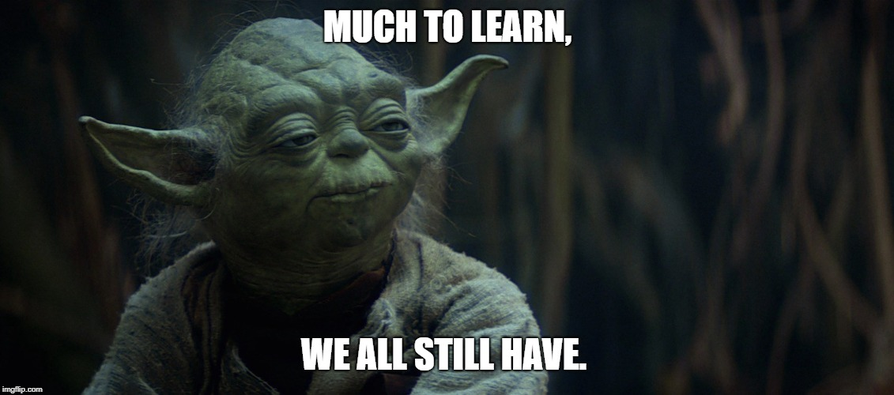

# Journal — 2025-09-27

## 1) What I learned (bullets, not prose)

- Testing and validation are essential to build trust in data.
- Dimensional modeling helps organize data for easier analysis.
- Normalization is really helpful when working with raw or unclear parts of the data. 
It’s best applied in the clean layer to make the data more organized.
- Star schema makes querying much easier. It belongs in the mart layer since it’s meant for end users.
- Dimension and fact tables should be placed in the mart layer.

## 2) New vocabulary (define in your own words)
- Dimensional modeling: structuring data into facts and dimensions for analysis.
- Star Schema: joins "Dimension Table" into "Fact Table"
- Snowflake Schema: joins "Dimension Table" into "Dimension Table"

## 3) Data Engineering mindset applied (what principles did I use?)
- Data cleaning, transformation, and querying aren’t optional.
It is essential since they’re what make the data accurate and reliable.

## 4) Decisions & assumptions (why, alternatives, trade-offs)
- Star schema is way more easier to understand and query.
- We divided tasks as a group so we could finish on time, instead of each doing the same work.

## 5) Open questions (things I still don’t get)
- I’m not yet sure how to decide the right level of data cleaning. Should every small error be fixed, or is it okay to allow some imperfections if the overall analysis still works?

## 6) Next actions (small, doable steps)
- I realized that I still need more practice in doing our assignment on my own. 
During group work, I sometimes rely on my teammates, but I want to build more confidence by practicing independently. 
By working on small examples, I believe I can improve my skills and understand the process better. This way, I’ll be more prepared for future tasks and able to contribute more to the group.

## 7) Artifacts & links (code, queries, dashboards)

---

### Mini reflection (3–5 sentences)
During our previous session, we had a group task and, to be honest, we crammed most of it. But even though it felt a bit rushed, I actually enjoyed the teamwork. 
We divided the tasks, helped each other, and still managed to finish everything. I’m happy that even with little time, we pulled it off together. 
Next time, I’m confident we’ll handle the task with less pressure and gain an even better understanding of the assignment.
It is also essential to always check the rows, sums, and outliers at every stage. 
As a group, we also need to make sure our pipeline leads to one clear and consistent source of truth.

### BONUS: What is a meme that best describes what you feel or your learning today?

